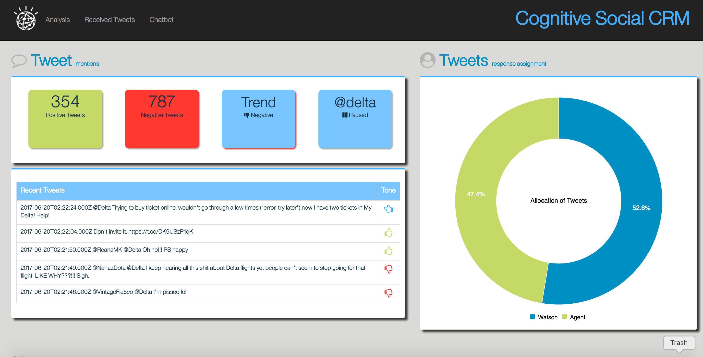
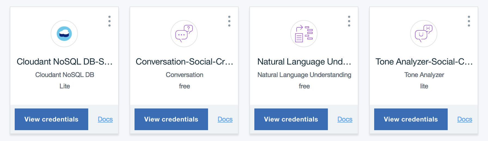

# Social CRM Accelerator
WORK IN PROGRESS - Complete code coming soon!

## Overview

Capture and analyze social media for a specified Twitter handle or hashtag and let Watson analyze the content.



# Description

This Accelerator will subscribe to Twitter screen names or hashtags and analyze the content with Tone, Sentiment and Entity extraction and use the Conversation API to classify (Intents) the tweets.  The enriched meta data is then saved to a Cloudant database where Map Reduce functions are used to provide a high level insight into the data.

The Accelerator provides you with the Twitter listener, a Dashboard that can be extended and a Chatbot, accessible from this web application or from Twitter.

Due to the potential for a large volume of API calls, this Accelerator will work best with a paid subscription to Bluemix.  If you try and use this accelerator on an screen name that produces a lot of tweets, then you take the risk of using up your free allocation of API calls very quickly.  The Accelerator will suspend for 15 minutes listening to tweets if there are errors returned from the enrichment pipeline.  When the receiver on the UI is paused, it usually means you have exceeded your limit for the day.

# Required Services

This Accelerator requires 4 services to be created.  You can reuse services by binding existing services to this application.



- Cloudant NoSql DB
- Watson Tone Analyzer
- Watson Natural Language Understanding
- Conversation (For Custom Implementations)

## Prerequisites

The application requires the following software to be installed locally.

1. Node (6.9+) Application runtime environment
2. NPM (3.10+) Server side dependency management
3. Angular CLI (1.0.0) `npm install -g @angular/cli`

> If you have Angular CLI already installed.  Please read the upgrade instructions for Angular CLI when you upgrade the software.

# Setup Instructions

The setup is done in 3 primary steps.  You will download the code, setup the application and then deploy the code to Bluemix.  If you would like to run the code locally, there will be one more step to configure the credentials locally.

## Deploy to Bluemix
[](https://bluemix.net/deploy?repository=https://github.com/IBM/cognitive-social-crm)

## Downloading the code

1. Clone the app to your local environment from your terminal using the following command:

  ```
  git clone https://github.ibm.com/Watson-Solutions-Lab/social-crm-starter-app.git
  ```
2. `cd` into this newly created directory

# Twitter requirements

To implement the Watson Chatbot and subscribe to Tweets from a specific handle or hashtag in this application, it is required to create a Twitter account with an application.

The Twitter account will be used as the Chatbot account that receives the messages from other Twitter users as well as the owner of the application, required by Twitter, to receive Tweets.

You can create a normal Twitter account on [Twitter](https://twitter.com/signup).  It is required to provide a unique email id that isn't already associated with an existing Twitter account as well as a phone number to verify the account.  You can use a email service like gmail or yahoo to create email accounts for each Twitter account.  Although a phone number is not required when creating the account, it is required when you create an application.

Once you have the Twitter account created and verified, log in to [Twitter Dev](https://apps.twitter.com/) and create an application.  Select the Keys and Access Tokens tab and generate a Consumer Key and Secret.

Keep this page open as you will need to use these tokens into setup procedure in the application later on.

## Setting up Bluemix

> Explanation: You will create a placeholder application in Bluemix that connects to all the required services first.

1. If you do not already have a Bluemix account, [sign up here](https://console.ng.bluemix.net/registration).
2. Download and install the [Cloud Foundry CLI](https://console.ng.bluemix.net/docs/cli/index.html#cli) tool.
3. Log into Bluemix with our account.
4. From the Application Dashboard, Create a new Application.
  - On the left, select Apps > Cloudfoundry Apps.
  - On the right, select SDK for Node.js.
  - Provide a unique name for your application.
5. Once the application is created, go into the application and select Connections.
6. Create the required services and bind them to the newly created application.
7. Leave the Connections page open, as you will reference the credentials in the subsequent setup step.

## Load/Create the Conversation API workspaces

> Note: Although we do provide you with a sample classification workspace and dialog workspace.  The idea is that you create your own that is relevant to your domain.

> Note: This Accelerator uses Watson Conversation Intent detection as classification method for the tweets, and not NLC.

1. Log into Bluemix with our account.
2. Navigate to the newly created Social CRM application.
3. From the Connections Panel, select the Conversation Instance.
4. Click the Launch Tool button.
5. Click the Import Workspace Button.
6. Select the Choose file button and navigate to the application folder /accelerator/wcs
7. Select the `workspace-social-crm-airline-classification.json` file.
8. Import everything.
9. Do the same for the `workspace-social-crm-airline-dialog.json` file.

## Configuration files

There are 2 sample configuration files that are required by the application.

The `env-vars-example.json` file should be copied to `env-vars.json` before the application is executed on Bluemix or locally.

The `vcap-local-example.json` file should be copied to `vcap-local.json` before the application is executed locally.  This file contains your service credentials required to run the application locally.  If the app is run on Bluemix, the app will use the VCAP service information on Bluemix.  The sample file is a skeleton of what is required, but, you have to fill in the details.

> The `env-vars.json` file is where all the parameters of this application is kept.  The setup utility, explained later, will guide you through setting up the parameters in this file, but you can come back and modify them at any time.

## Installing the dependencies

The server dependencies are controlled and defined in [the main package.json](./package.json).

The client dependencies are controlled and defined in [the client package.json](./client/package.json).

Run the following command, from the application folder, to install both the client and server dependencies.

```
npm install
```

## Configuring the application

The Social CRM application consist of a Setup utility that you can run that will update the configuration files required by the application.

In the directory where to code is located (previously downloaded and cd'ed into) run the following command

```
npm run setup
```

The setup utility consist of a number of actions that should be performed.

### Cloudant

This action will create the databases required to run the application as well as load all the design documents and indexes.  You need to have the Cloudant username and password handy, which you can find in the credentials of your Cloudant service in Bluemix.

### Twitter

This action will update the configuration with the parameters needed to connect to Twitter as well as subscribe to tweets.  You need to have the Consumer Key (API Key), Consumer Secret (API Secret), Access Token and Access Token Secret from dev.twitter.com available.

At this point you should have decided what Twitter handle you will be "listening" to.  The Twitter handle would be something other people would tweet to, for example `@united`, `@AmericanAir`, `@JetBlue` (Please note that these are CASE SENSITIVE) etc.  This value is what Twitter would use as trigger to send you the tweets.

When you selected the `Twitter` option on the main menu of the setup utility, you will be required to enter the Twitter Tokens first.  Then the screen name you are listening to, the Conversation API workspace id for the classifications and finally the Chatbot screen name and Conversation API workspace for the Dialog implementation.

The chatbot screen name is your own Twitter account.  DO NOT USE THE SAME TWITTER SCREEN NAME YOU USED TO LISTEN TO.  This way, when you want to chat to the Chatbot via Twitter, you can use your own screen name for example `@mysuperbot blah blah blah` to send messages to your bot.

If you don't want to implement a Chatbot, then leave this blank, and the Chatbot won't be started.

### Testing Twitter

The next option is to test out the Twitter parameters.  When you select this option from the setup utility's main menu, the listener will be started and you will see tweets being received and displayed on the console.  If some of the parameters are incorrect, then you should see the error.

### Searching for Tweets

> Note: If you want to leverage this feature, you have to complete the local setup.

You sometimes want to populate your database with previous Tweets.  This Accelerator provides you with the ability to go back 7 days to search for tweets that match your "listen to" screen name.  It will do the enrichment and place the tweets into the database.

## Running the app on Bluemix

Use the name of the application you created previously to update the configuration files locally.

1. Open the `manifest.yml` file and change the `name` AND `host` value to the unique application name you created on Bluemix previously.

2. Compile the Angular 2 client code using the following command.

  ```
  $ npm run build:client
  ```
3. Connect to Bluemix in the command line tool and follow the prompts to log in

  ```
  $ cf login -a https://api.ng.bluemix.net
  ```
4. Push the app to Bluemix.

  ```
  $ cf push
  ```
5. The application should now be running on Bluemix and listening to Tweets.  You can access the application URL using the application name you defined in the manifest.yml file with a '.mybluemix.net' appended to it.

6. The application is secured with a username and password. See the end of this README for details.

## Running the app locally

To run the application locally (your own computer), you have to install additional Node.js modules and configure the application with some credentials that is provisioned on Bluemix.

### Starting the application

There are a few quick steps required to stand up the application. In general, the required tasks are.

1. Install the server and client dependencies
2. Commission the required services
3. Configure the environment variables in manifest.yml (cloud deployment) or .env (local deployment)
4. Build and run or deploy

## The Local VCAP file

The vcap-local.json file consist of your Bluemix service credentials when you run the application locally.

This file must be updated with your service credentials before the application can be executed.

1. On the Bluemix Application page, select the Connections option on the left.
2. Select each of the services you provisioned earlier and view the credentials.
3. Copy the credentials using the 'copy' icon.
4. Edit the vcap-local.json file.
5. Paste the content of the clipboard into the vcap.local file.
6. The structure of this file consist of a service name and a json object, but the pasted value is wrapped in another ```{ }``` that should be removed.
7. A sample of what it should look like below;

```
{
  "cloudantNoSQLDB": [
    {
      "credentials": {
        ...
      },
      "syslog_drain_url": null,
      "label": "cloudantNoSQLDB",
      "provider": null,
      "plan": "Lite",
      "name": "Cloudant NoSQL DB-xx",
      "tags": [
        "data_management",
        "ibm_created",
        "ibm_dedicated_public"
      ]
    }
  ]
}
```

8. Once all the credentials are in place, the application can be starter with `npm run develop`.

## Accessing the Application

There is only 1 user required for this application.  This user is `watson` with a password of `p@ssw0rd`

The user names and passwords can be modified in the /server/boot/init-access.js file.

## Customization

There are some customization what can be done in the application apart from using your own Twitter screen name to monitor and the conversation workspaces you provide.

1. The server component is configured with the `env-vars.json` file.
2. The client has some configuration that can be modified in the `client/src/app/shared/config.service.ts` file.

# Privacy Notice

Sample web applications that include this package may be configured to track deployments to [IBM Bluemix](https://www.bluemix.net/) and other Cloud Foundry platforms. The following information is sent to a [Deployment Tracker](https://github.com/IBM-Bluemix/cf-deployment-tracker-service) service on each deployment:

* Node.js package version
* Node.js repository URL
* Application Name (`application_name`)
* Application GUID (`application_id`)
* Application instance index number (`instance_index`)
* Space ID (`space_id`)
* Application Version (`application_version`)
* Application URIs (`application_uris`)
* Labels of bound services
* Number of instances for each bound service and associated plan information

This data is collected from the `package.json` file in the sample application and the `VCAP_APPLICATION` and `VCAP_SERVICES` environment variables in IBM Bluemix and other Cloud Foundry platforms. This data is used by IBM to track metrics around deployments of sample applications to IBM Bluemix to measure the usefulness of our examples, so that we can continuously improve the content we offer to you. Only deployments of sample applications that include code to ping the Deployment Tracker service will be tracked.

## Disabling Deployment Tracking

Please see the README for the sample application that includes this package for instructions on disabling deployment tracking, as the instructions may vary based on the sample application in which this package is included.
