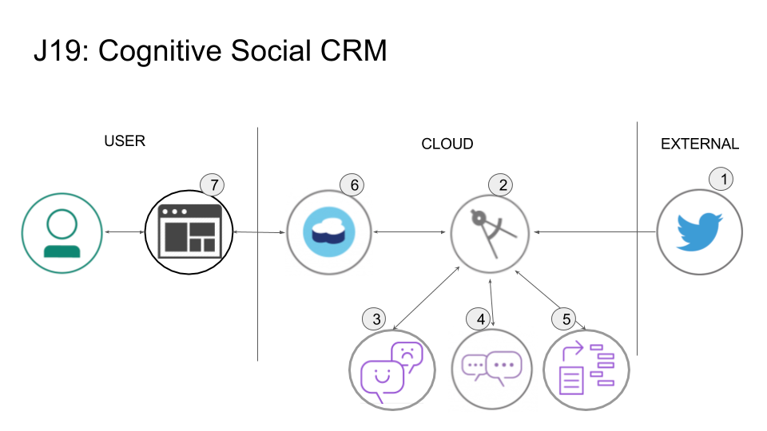
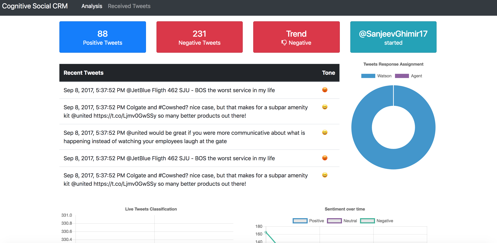
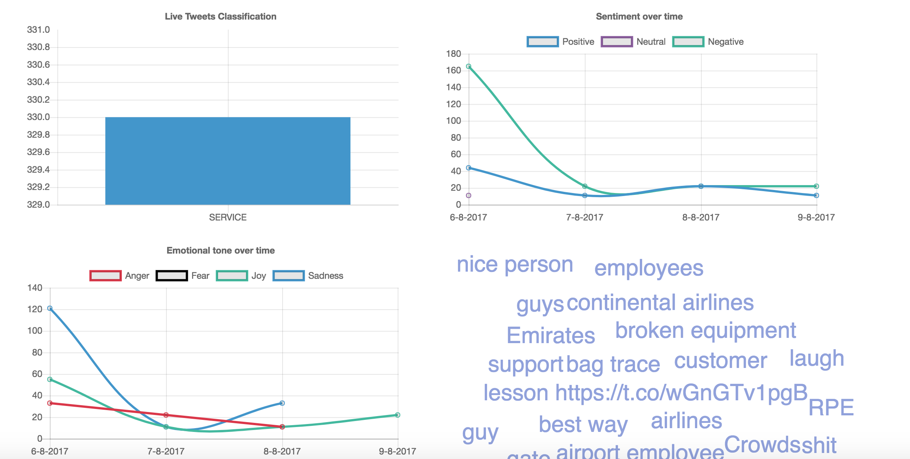
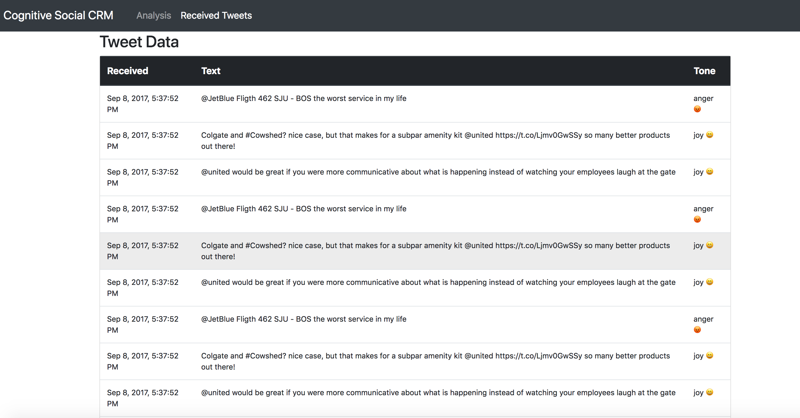

*Read this in other languages: [日本語](README-ja.md).*

[](https://travis-ci.org/IBM/cognitive-social-crm)

# Monitor Twitter feeds to better understand customer sentiment using Watson Assistant, Tone Analyzer, and Natural Language Understanding

In this code pattern, our server application subscribes to a Twitter feed as configured by the user. Each tweet received will be analyzed for emotional tone and sentiment, and the intent of the tweet will be determined by the Watson Assistant service. All data is stored in a Cloudant database, with the opportunity to store historical data as well. The resulting analysis is presented in a Web UI as a series of graphs and charts.

When the reader has completed this code pattern, they will understand how to:

* Run an application that monitors a Twitter feed.
* Send the tweets to Watson Tone Analyzer, Assistant, and Natural Language Understanding for processing and analysis.
* Store the information in a Cloudant database.
* Present the information in a Angular and nodejs web UI.
* Capture and analyze social media for a specified Twitter handle or hashtag and let Watson analyze the content.

## Flow



1. Tweets are pushed out by Twitter.
2. The Cognitive Social CRM app processes the tweet.
3. The Watson Tone Analyzer Service performs analysis of sentiment and emotional tone.
4. The Watson Natural Language Understanding Service pulls out keywords and entities.
5. The Watson Assistant Service extracts the intents (verbs) from the tweets.
6. Tweets and metadata are stored in Cloudant
7. The Web UI displays charts and graphs as well as the tweets.

## Included components

* [Watson Assistant](https://www.ibm.com/watson/services/conversation/): Watson Assistant is a robust platform that allows developers and non-technical users to collaborate on building conversational AI solution.
* [Watson Tone Analyzer](https://www.ibm.com/watson/services/tone-analyzer): Uses linguistic analysis to detect communication tones in written text.
* [Watson Natural Language Understanding](https://www.ibm.com/watson/services/natural-language-understanding): Natural language processing for advanced text analysis.
* [IBM Cloudant](https://www.ibm.com/analytics/us/en/technology/cloud-data-services/cloudant): A managed NoSQL database service that moves application data closer to all the places it needs to be — for uninterrupted data access, offline or on.
* [Cloud Foundry](http://cloudfoundry.org/): Build, deploy, and run applications on an open source cloud platform.

## Featured technologies

* [Artificial Intelligence](https://medium.com/ibm-data-science-experience): Artificial intelligence can be applied to disparate solution spaces to deliver disruptive technologies.
* [Databases](https://en.wikipedia.org/wiki/IBM_Information_Management_System#.22Full_Function.22_databases): Repository for storing and managing collections of data.
* [Angular](https://angular.io/): A framework to build UI for mobile and desktop application.
* [Node.js](https://nodejs.org/): An open-source JavaScript run-time environment for executing server-side JavaScript code.
* [Express](https://expressjs.com/): Fast, unopinionated, minimalist web framework for Node.js

# Watch the Video

[](https://youtu.be/aWKi4f6gytc)

# Steps

The setup is done in 3 primary steps.  You will download the code, setup the application and then deploy the code to IBM Cloud.  If you would like to run the code locally, there will be one more step to configure the credentials locally.

1. [Clone the repo](#1-clone-the-repo)
2. [Install Dependencies](#2-install-dependencies)
3. [Twitter Requirements](#3-twitter-requirements)
4. [Create Watson services with IBM Cloud](#4-create-watson-services-with-ibm-cloud)
5. [Import the Assistant workspace](#5-import-the-conversation-workspace)
6. [Configure credentials](#6-configure-credentials)
7. [Run the application](#7-run-the-application)

### 1. Clone the repo

Clone the `cognitive-social-CRM` locally. In a terminal, run:

```
$ git clone https://github.com/IBM/cognitive-social-crm
$ cd cognitive-social-crm
```

### 2. Install dependencies

The application requires the following software to be installed locally.

1. [Node (6.9+)](https://nodejs.org): Application runtime environment, download and install the package.
1. [Angular CLI (6.1.1)](https://www.npmjs.com/package/@angular/cli): A CLI for Angular applications, installed with: `npm install -g @angular/cli`.
1. [Angular (6.1.0)](https://angular.io): Angular will be added as a dependency of client in `package.json` when setting up client using `Angular cli`.
1. [Express (4.16.3)](https://expressjs.com): Express will be added as a dependency in `package.json` for server.

> If you have Angular CLI already installed.  Please read the upgrade instructions for Angular CLI when you upgrade the software.

Run the following command, from the application folder, to install both the client and server dependencies.

```
$ npm run app-install
```

### 3. Twitter requirements

To subscribe to Tweets from a specific handle or hashtag in this application, it is required to create a Twitter account and a Twitter application.
The Twitter account will be used as the account that receives the messages from other Twitter users as well as the owner of the application, required by Twitter, to receive Tweets.
* You can create a normal Twitter account on [Twitter](https://twitter.com/signup) or use an existing account.  It is required to provide a unique email id that isn't already associated with an existing Twitter account as well as a phone number to verify the account.
* Once you have the Twitter account created and verified, log in to [Twitter Dev](https://apps.twitter.com/) and create an application.
* Select the Keys and Access Tokens tab and generate a Consumer Key and Secret.
Keep this page open as you will need to use these tokens into setup procedure in the application later on.

### 4. Create Watson services with IBM Cloud

Either Setup the IBM Cloud Deployment or Setup Local Deployment.

#### Setting up IBM Cloud Deployment

> Explanation: You will create a placeholder application in IBM Cloud that connects to all the required services first.

1. If you do not already have a IBM Cloud account, [sign up for Bluemix](https://console.bluemix.net/registration).
2. Download and install the [Cloud Foundry CLI](https://console.bluemix.net/docs/cli/index.html#cli) tool.
3. Log into IBM Cloud with your account.
4. From the `Application Dashboard`, create a new `Application`.
  - On the left, select `Apps` > `Cloudfoundry Apps`.
  - On the right, select `SDK for Node.js`.
  - Provide a unique name for your application.
5. Once the application is created, go into the application and select `Connections`.
6. Create the required services and bind them to the newly created application: `Natural Language Understanding`, `Tone Analyzer`, and `Cloudant NoSQL DB`.
7. Leave the `Connections` page open, as you will reference the credentials in the next step.

#### Setup local Deployment

> Explanation: You will create the  IBM Cloud services and configure them to use on a locally running server app.

If you do not already have a IBM Cloud account, [sign up for Bluemix](https://console.bluemix.net/registration).
Create the following services:

* [**Watson Tone Analyzer**](https://console.bluemix.net/catalog/services/tone-analyzer)
* [**Watson Natural Language Understanding**](https://console.bluemix.net/catalog/services/natural-language-understanding)
* [**IBM Cloudant DB**](https://console.bluemix.net/catalog/services/cloudant-nosql-db)

### 5. Import the Assistant workspace

Launch the **Watson Assistant** tool. Use the **import** icon button on the right

Find the local version of [`data/assistant/workspace-social-crm-airline-classification.json`](data/assistant/workspace-social-crm-airline-classification.json) and select
**Import**. Find the **Workspace ID** by clicking on the context menu of the new
workspace and select **View details**. Save this ID for later.

### 6. Configure credentials

The `env.sample` file should be copied to `.env` before the application is executed on IBM Cloud or locally. The `.env` file resides on the `server` folder as it is required by the server code.

> The `.env` file is where all the parameters like credentials, log settings and other constants required by this application is kept.

#### Configure service credentials

The credentials for IBM Cloud services (Tone Analyzer, Natural Language Understanding, and Cloudant), can be found in the ``Services`` menu in IBM Cloud, by selecting the ``Service Credentials`` option for each service.

From the root of the project, go to `server` folder (`cd server`) and 

Copy the [`env.sample`](server/env.sample) to `.env`.

```
$ cd server
$ cp env.sample .env
```

Add all the credentials that you have saved from creating the services, as explained earlier, in the `.env` file. 

#### `env.sample`

```
# Copy this file to .env and replace the credentials with 
# your own before starting the app.

CLOUDANT_USERNAME=<use cloudant username>
CLOUDANT_PASSWORD=<use cloudant password>
CLOUDANT_ANALYSIS_DB_NAME=analysis_db

## Un-comment and use either username+password or IAM apikey.
# NATURAL_LANGUAGE_UNDERSTANDING_USERNAME=<use natural language understanding username>
# NATURAL_LANGUAGE_UNDERSTANDING_PASSWORD=<use natural language understanding password>
NATURAL_LANGUAGE_UNDERSTANDING_IAM_APIKEY=<use natural language understanding iam API key>
NATURAL_LANGUAGE_UNDERSTANDING_URL=<use natural language understanding URL>

## Un-comment and use either username+password or IAM apikey.
# TONE_ANALYZER_USERNAME=<use tone analyzer username>
# TONE_ANALYZER_PASSWORD=<use tone analyzer password>
TONE_ANALYZER_IAM_APIKEY=<use tone analyzer iam API key>
TONE_ANALYZER_URL=<use tone analyzer url>

## Un-comment and use either username+password or IAM apikey.
# ASSISTANT_USERNAME=<use assistant username>
# ASSISTANT_PASSWORD=<use assistant password>
ASSISTANT_IAM_APIKEY=<use assistant iam apikey>
ASSISTANT_URL=<use assistant url>

ASSISTANT_CLASSIFICATION_WORKSPACE_ID=<use assistant workspace id>

# Configuration from you twitter account
TWITTER_CONSUMER_KEY=<use twitter consumer key>
TWITTER_CONSUMER_SECRET=<use twitter consumer secret>
TWITTER_ACCESS_TOKEN=<use twitter access token>
TWITTER_ACCESS_SECRET=<use twitter access secret>
#TWITTER_LISTEN_FOR=<use twitter hashtag or keyword or @tag>
TWITTER_LISTEN_TO=<use your @tag>
TWITTER_FILTER_CONTAINING=<use keyword you want to filter in tweets>
TWITTER_PROCESS_RETWEETS=true

# App level configuration
LOGGING=true
LOG_LEVEL=info
OUTPUT_TYPE=json
SAVE_TYPE=cloudant

```


### 7. Run the application

Either `Run the app on IBM Cloud` or `Run the app locally`.

#### Running the app on IBM Cloud

Use the name of the application you created previously to update the configuration files locally.

1. Open the `manifest.yml` file and change the `name` AND `host` value to the unique application name you created on IBM Cloud previously.

2. Compile the Angular client code and Express server code using the following command.

  ```
  $ npm run build
  ```
3. Connect to IBM Cloud in the command line tool and follow the prompts to log in

  ```
  $ cf login -a https://api.ng.bluemix.net
  ```
4. Push the app to IBM Cloud.

  ```
  $ cf push
  ```
5. The application should now be running on IBM Cloud and listening to Tweets.  You can access the application URL using the application name you defined in the `manifest.yml` file with a '.mybluemix.net' appended to it.


#### Running the app locally

Once all the credentials are in place, the application can be started with:

```
$ npm run start
```

The server runs on port `3000` and the `client` runs on port `4200`. You can access the UI by accessing the following URL in the browser:

`http://localhost:4200`


## Sample Output

You will see informations about Tweets:



as well as Classification of live tweets, Sentiment over time, Emotional Tone over time, and Keywords mentioned:





# Links
* [Watson Assistant](https://www.ibm.com/watson/services/conversation/)
* [Watson Tone Analyzer](https://www.ibm.com/watson/services/tone-analyzer/)
* [Watson Natural Language Understanding](https://www.ibm.com/watson/services/natural-language-understanding/)
* [IBM Cloudant db](https://www.ibm.com/cloud/cloudant)

# Learn more

* **Artificial Intelligence Code Patterns**: Enjoyed this Code Pattern? Check out our other [AI Code Patterns](https://developer.ibm.com/code/technologies/artificial-intelligence/).
* **AI and Data Code Pattern Playlist**: Bookmark our [playlist](https://www.youtube.com/playlist?list=PLzUbsvIyrNfknNewObx5N7uGZ5FKH0Fde) with all of our Code Pattern videos
* **With Watson**: Want to take your Watson app to the next level? Looking to utilize Watson Brand assets? [Join the With Watson program](https://www.ibm.com/watson/with-watson/) to leverage exclusive brand, marketing, and tech resources to amplify and accelerate your Watson embedded commercial solution.
