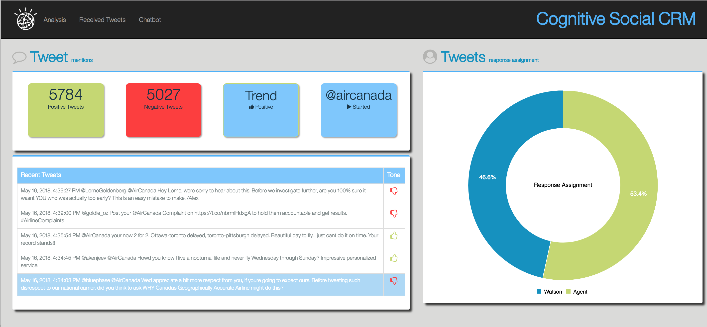
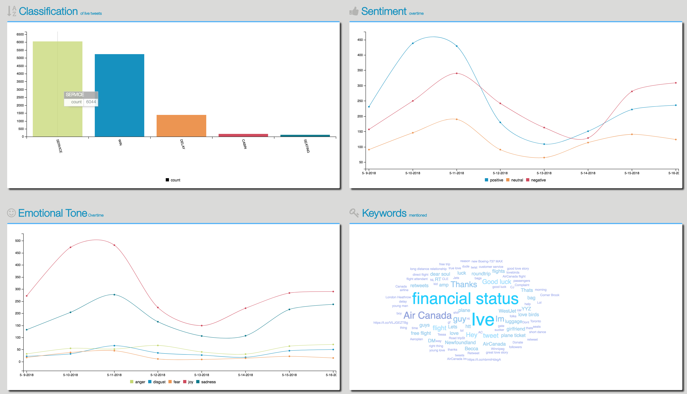

[](https://travis-ci.org/IBM/cognitive-social-crm)

# Monitor Twitter feeds to better understand customer sentiment using Watson Assistant, Tone Analyzer, and Natural Language Understanding

> Watson Conversation is now Watson Assistant. Although some images in this code pattern may show the service as Watson Conversation, the steps and processes will still work.

In this journey, our server application subscribes to a Twitter feed as configured by the user. Each tweet received will be analyzed for emotional tone and sentiment, and the intent of the tweet will be determined by the Watson Assistant service. All data is stored in a Cloudant database, with the opportunity to store historical data as well. The resulting analysis is presented in a Web UI as a series of graphs and charts.
Credit goes to [Werner Vanzyl](https://www.linkedin.com/in/werner-vanzyl-326a589) as the author of the original code and documents.

When the reader has completed this journey, they will understand how to:

* Run an application that monitors a Twitter feed.
* Send the tweets to Watson Tone Analyzer, Assistant, and Natural Language Understanding for processing and analysis.
* Store the information in a Cloudant database.
* Present the information in a Node.js web UI.
* Capture and analyze social media for a specified Twitter handle or hashtag and let Watson analyze the content.

## Flow


1. Tweets are pushed out by Twitter.
2. The Cognitive Social CRM app (server.js) processes the tweet.
3. The Watson Tone Analyzer Service performs analysis of sentiment and emotional tone.
4. The Watson Natural Language Understanding Service pulls out keywords and entities.
5. The Watson Assistant Service extracts the intents (verbs) from the tweets.
6. Tweets and metadata are stored in Cloudant
7. The Web UI displays charts and graphs as well as the tweets.

## Included components

* [Watson Assistant](https://www.ibm.com/watson/services/conversation): Build, test and deploy a bot or virtual agent across mobile devices, messaging platforms, or even on a physical robot.
* [Watson Tone Analyzer](https://www.ibm.com/watson/services/tone-analyzer): Uses linguistic analysis to detect communication tones in written text.
* [Watson Natural Language Understanding](https://www.ibm.com/watson/services/natural-language-understanding): Natural language processing for advanced text analysis.
* [IBM Cloudant](https://www.ibm.com/analytics/us/en/technology/cloud-data-services/cloudant): A managed NoSQL database service that moves application data closer to all the places it needs to be — for uninterrupted data access, offline or on.
* [Cloud Foundry](http://cloudfoundry.org/): Build, deploy, and run applications on an open source cloud platform.

## Featured technologies

* [Artificial Intelligence](https://medium.com/ibm-data-science-experience): Artificial intelligence can be applied to disparate solution spaces to deliver disruptive technologies.
* [Databases](https://en.wikipedia.org/wiki/IBM_Information_Management_System#.22Full_Function.22_databases): Repository for storing and managing collections of data.
* [Node.js](https://nodejs.org/): An open-source JavaScript run-time environment for executing server-side JavaScript code.

# Watch the Video

[](https://youtu.be/aWKi4f6gytc)

# Steps

The setup is done in 3 primary steps.  You will download the code, setup the application and then deploy the code to IBM Cloud.  If you would like to run the code locally, there will be one more step to configure the credentials locally.

1. [Clone the repo](#1-clone-the-repo)
2. [Install Dependencies](#2-install-dependencies)
3. [Twitter Requirements](#3-twitter-requirements)
4. [Create Watson services with IBM Cloud](#4-create-watson-services-with-ibm-cloud)
5. [Import the Assistant workspace](#5-import-the-conversation-workspace)
6. [Configure credentials](#6-configure-credentials)
7. [Run the application](#7-run-the-application)

### 1. Clone the repo

Clone the `cognitive-social-CRM` locally. In a terminal, run:

```
$ git clone https://github.com/IBM/cognitive-social-crm
$ cd cognitive-social-crm
```

We’ll be using the file [`data/conversation/workspaces/workspace-social-crm-airline-classification.json`](data/conversation/workspaces/workspace-social-crm-airline-classification.json) to configure our Watson Assistant workspace.

### 2. Install dependencies

The application requires the following software to be installed locally.

1. [Node (6.9+)](https://nodejs.org): Application runtime environment, download and install the package.
1. [Angular CLI (1.0.0)](https://www.npmjs.com/package/@angular/cli): A CLI for Angular applications, installed with: `npm install -g @angular/cli`.

> If you have Angular CLI already installed.  Please read the upgrade instructions for Angular CLI when you upgrade the software.

Run the following command, from the application folder, to install both the client and server dependencies.

```
$ npm install
```

### 3. Twitter requirements

To subscribe to Tweets from a specific handle or hashtag in this application, it is required to create a Twitter account and a Twitter application.
The Twitter account will be used as the account that receives the messages from other Twitter users as well as the owner of the application, required by Twitter, to receive Tweets.
* You can create a normal Twitter account on [Twitter](https://twitter.com/signup) or use an existing account.  It is required to provide a unique email id that isn't already associated with an existing Twitter account as well as a phone number to verify the account.
* Once you have the Twitter account created and verified, log in to [Twitter Dev](https://apps.twitter.com/) and create an application.
* Select the Keys and Access Tokens tab and generate a Consumer Key and Secret.
Keep this page open as you will need to use these tokens into setup procedure in the application later on.

### 4. Create Watson services with IBM Cloud

Either Setup the IBM Cloud Deployment or Setup Local Deployment.

#### Setting up IBM Cloud Deployment

> Explanation: You will create a placeholder application in IBM Cloud that connects to all the required services first.

1. If you do not already have a IBM Cloud account, [sign up for Bluemix](https://console.bluemix.net/registration).
2. Download and install the [Cloud Foundry CLI](https://console.bluemix.net/docs/cli/index.html#cli) tool.
3. Log into IBM Cloud with your account.
4. From the `Application Dashboard`, create a new `Application`.
  - On the left, select `Apps` > `Cloudfoundry Apps`.
  - On the right, select `SDK for Node.js`.
  - Provide a unique name for your application.
5. Once the application is created, go into the application and select `Connections`.
6. Create the required services and bind them to the newly created application: `Watson Assistant`, `Natural Language Understanding`, `Tone Analyzer`, and `Cloudant NoSQL DB`.
7. Leave the `Connections` page open, as you will reference the credentials in the next step.

#### Setup local Deployment

> Explanation: You will create the  IBM Cloud services and configure them to use on a locally running server app.

If you do not already have a IBM Cloud account, [sign up for Bluemix](https://console.bluemix.net/registration).
Create the following services:

* [**Watson Assistant**](https://console.bluemix.net/catalog/services/conversation)
* [**Watson Tone Analyzer**](https://console.bluemix.net/catalog/services/tone-analyzer)
* [**Watson Natural Language Understanding**](https://console.bluemix.net/catalog/services/natural-language-understanding)
* [**IBM Cloudant DB**](https://console.bluemix.net/catalog/services/cloudant-nosql-db)

### 5. Import the Assistant workspace

Launch the **Watson Assistant** tool. Use the **import** icon button on the right

Find the local version of [`data/conversation/workspaces/workspace-social-crm-airline-classification.json`](data/conversation/workspaces/workspace-social-crm-airline-classification.json) and select
**Import**. Find the **Workspace ID** by clicking on the context menu of the new
workspace and select **View details**. Save this ID for later.

### 6. Configure credentials

The `env-vars-example.json` file should be copied to `env-vars.json` before the application is executed on IBM Cloud or locally.

> The `env-vars.json` file is where all the parameters of this application is kept.  The setup utility, explained later, will guide you through setting up some of the parameters in this file, but you can come back and modify them at any time.


#### Configure service credentials

The credentials for IBM Cloud services (Assistant, Tone Analyzer,
Natural Language Understanding, and Cloudant), can be found in the ``Services`` menu in IBM Cloud,
by selecting the ``Service Credentials`` option for each service.

The other setting for Assistant was collected during the
earlier setup steps (``WORKSPACE_ID``).

Copy the [`env-vars-example.json`](env-vars-example.json) to `env-vars.json`.

```
$ cp env-vars-example.json env-vars.json
```
Edit the `env-vars.json` file with the necessary settings.
The Cloudant and Twitter settings will be populated when you execute `npm run setup` in the next step. These variables could be hand edited if you wish, but the setup utility is required to create the Cloudant documents.

#### `env-vars-example.json:`

```
{

  "CLOUDANT_CONNECTION_URL": <populated by `npm run setup`>,
  "CLOUDANT_USERNAME": <populated by `npm run setup`>,
  "CLOUDANT_PASSWORD": <populated by `npm run setup`>,
  "CLOUDANT_ANALYSIS_DB_NAME": "analysis-db",
  "CLOUDANT_CONVERSATION_STATE_DB_NAME": "conversation-state-db",

  "CONVERSATION_API_URL": "",
  "CONVERSATION_API_USER": "",
  "CONVERSATION_API_PASSWORD": "",
  "CONVERSATION_CLASSIFICATION_WORKSPACE_ID": "",

  "NLU_API_USER": "",
  "NLU_API_PASSWORD": "",

  "TONE_ANALYZER_USER": "",
  "TONE_ANALYZER_PASSWORD": "",

  "TWITTER_CONSUMER_KEY": <populated by `npm run setup`>,
  "TWITTER_CONSUMER_SECRET": <populated by `npm run setup`>,
  "TWITTER_ACCESS_TOKEN": <populated by `npm run setup`>,
  "TWITTER_ACCESS_SECRET": <populated by `npm run setup`>,
  "TWITTER_LISTEN_FOR": "populated by `npm run setup`",
  "TWITTER_FILTER_FROM": "populated by `npm run setup`",
  "TWITTER_FILTER_CONTAINING": "populated by `npm run setup`",
  "TWITTER_PROCESS_RETWEETS": false,
  "TWITTER_RECEIVER_START_AT_BOOT": true,
  "TWITTER_CHATBOT_SCREENNAME": <populated by `npm run setup`,
  "TWITTER_CHATBOT_START_AT_BOOT": true
}

```

#### Run Setup application

The Social CRM application consist of a Setup utility that you can run that will update the configuration files required by the application and create the Cloudant DB documents. It will also allow you to test Twitter and query the database.

In the directory where to code is located (previously downloaded and cd'ed into) run the following command

```
$ npm run setup
```

The setup utility consist of a number of actions that should be performed.

#### Cloudant

This action will create the databases required to run the application as well as load all the design documents and indexes.  You need to have the Cloudant username and password handy, which you can find in the credentials of your Cloudant service in IBM Cloud.

#### Twitter

This action will update the configuration with the parameters needed to connect to Twitter as well as subscribe to tweets.  You need to have the Consumer Key (API Key), Consumer Secret (API Secret), Access Token and Access Token Secret from dev.twitter.com available.

At this point you should have decided what Twitter handle you will be "listening" to.  The [Watson Assistant Intents](https://console.bluemix.net/docs/services/conversation/intents.html#defining-intents) for this journey are configured to work with a Twitter account for an airline, but you could create relevant intents for whichever business domain you wish. The Twitter handle would be something other people would tweet to, for example [`@aircanada`](https://twitter.com/AirCanada).  This value is what Twitter would use as trigger to send you the tweets.

> NOTE: Due to the potential for a large volume of API calls, this Accelerator will work best with a paid subscription to IBM Cloud.  If you try and use this accelerator on an screen name that produces a lot of tweets, then you take the risk of using up your free allocation of API calls very quickly.  The Accelerator will suspend for 15 minutes listening to tweets if there are errors returned from the enrichment pipeline.  When the receiver on the UI is paused, it usually means you have exceeded your limit for the day.

When you select the `Twitter` option on the main menu of the setup utility, you will be required to enter the Twitter Tokens first.  Continue to enter the screen name you are listening to, the Assistant API workspace id for the classifications, and finally the Chatbot screen name and Assistant API workspace for the Dialog implementation.

##### Testing Twitter

The next option is to test out the Twitter parameters.  When you select this option from the setup utility's main menu, the listener will be started and you will see tweets being received and displayed on the console.  If some of the parameters are incorrect, then you should see the error.

##### Searching for Tweets

> Note: If you want to leverage this feature, you have to complete the local setup.

You sometimes want to populate your database with previous Tweets.  This Accelerator provides you with the ability to go back 7 days to search for tweets that match your "listen to" screen name.  It will do the enrichment and place the tweets into the database.

### 6. Run the application

Either `Run the app on IBM Cloud` or `Run the app locally`.

#### Running the app on IBM Cloud

Use the name of the application you created previously to update the configuration files locally.

1. Open the `manifest.yml` file and change the `name` AND `host` value to the unique application name you created on IBM Cloud previously.

2. Compile the Angular 2 client code using the following command.

  ```
  $ npm run build:client
  ```
3. Connect to IBM Cloud in the command line tool and follow the prompts to log in

  ```
  $ cf login -a https://api.ng.bluemix.net
  ```
4. Push the app to IBM Cloud.

  ```
  $ cf push
  ```
5. The application should now be running on IBM Cloud and listening to Tweets.  You can access the application URL using the application name you defined in the `manifest.yml` file with a '.mybluemix.net' appended to it.

6. The application is secured with a username and password. See the end of this README for details.

#### Running the app locally

Once all the credentials are in place, the application can be started with:

```
$ npm run develop
```

## Accessing the Application

There is only 1 user required for this application.  This user is `watson` with a password of `p@ssw0rd`

The user names and passwords can be modified in the `/server/boot/init-access.js` file.

## Customization

There are some customization what can be done in the application apart from using your own Twitter screen name to monitor and the conversation workspaces you provide.

1. The server component is configured with the `env-vars.json` file.
2. The client has some configuration that can be modified in the `client/src/app/shared/config.service.ts` file.

## Sample Output

You will see informations about Tweets:



as well as Classification of live tweets, Sentiment over time, Emotional Tone over time, and Keywords mentioned:



# Links
* [Watson Assistant](https://www.ibm.com/watson/services/conversation/)
* [Watson Tone Analyzer](https://www.ibm.com/watson/services/tone-analyzer/)
* [Watson Natural Language Understanding](https://www.ibm.com/watson/services/natural-language-understanding/)
* [IBM Cloudant db](https://www.ibm.com/cloud/cloudant)

# Learn more

* **Artificial Intelligence Code Patterns**: Enjoyed this Code Pattern? Check out our other [AI Code Patterns](https://developer.ibm.com/code/technologies/artificial-intelligence/).
* **AI and Data Code Pattern Playlist**: Bookmark our [playlist](https://www.youtube.com/playlist?list=PLzUbsvIyrNfknNewObx5N7uGZ5FKH0Fde) with all of our Code Pattern videos
* **With Watson**: Want to take your Watson app to the next level? Looking to utilize Watson Brand assets? [Join the With Watson program](https://www.ibm.com/watson/with-watson/) to leverage exclusive brand, marketing, and tech resources to amplify and accelerate your Watson embedded commercial solution.
